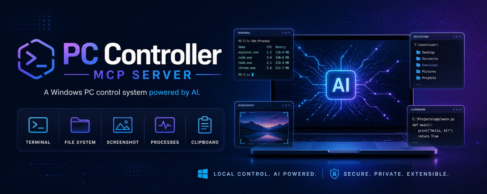

# PC Controller MCP Server



**Universal MCP Server for Windows PC Control**

[](https://www.typescriptlang.org/)
[](https://nodejs.org/)
[](https://modelcontextprotocol.io/)
[](LICENSE)
[](test/)

---

## 📋 Overview

PC Controller MCP Server is a powerful Model Context Protocol (MCP) server that enables AI assistants to control Windows PCs through a comprehensive set of tools. Built with TypeScript and Node.js, it provides seamless integration with AI clients like Claude Desktop, Cursor, Windsurf, and OpenClaude.

### 🎯 What It Does

This server bridges the gap between AI assistants and your Windows PC, allowing AI to:
- Execute shell commands and scripts
- Read, write, and search files
- Capture screenshots and view them
- Monitor system information and processes
- Manage clipboard content
- Open files, folders, and URLs
- And much more...

### 🔌 Compatibility

Works with any MCP-compatible AI client:
- ✅ Claude Desktop
- ✅ Cursor IDE
- ✅ Windsurf
- ✅ OpenClaude CLI
- ✅ ChatGPT (with appropriate configuration)
- ✅ Any MCP-compliant client

---

## ✨ Features

### 🛠️ 37 Powerful Tools

| Tool | Description |
|------|-------------|
| **run_command** | Execute shell commands (PowerShell default; also Git Bash & WSL via `shell` param) |
| **run_command_long** | Run long-running commands with extended timeout (2 minutes) |
| **file_read** | Read file contents with encoding support |
| **file_write** | Write files with automatic directory creation |
| **dir_list** | List directory contents with recursive option |
| **file_search** | Search files by glob pattern recursively |
| **screen_capture** | Capture screenshots as base64 images |
| **sys_info** | Get comprehensive system information |
| **process_list** | List running processes with filtering and sorting |
| **process_kill** | Force-terminate processes by name or PID |
| **open_path** | Open files, folders, or URLs with default applications |
| **clipboard_get** | Read the current text content of the system clipboard |
| **clipboard_set** | Copy text to the system clipboard |
| **zip_create** | Compress files/folders into a .zip archive |
| **zip_extract** | Extract a .zip archive to a folder |
| **window_focus** | Bring a window to the foreground (by title/process name) |
| **key_type** | Type text or send keystrokes to the focused window |
| **notify** | Show a Windows notification balloon with a title and message |
| **file_edit** | Surgical search & replace — edit specific text without overwriting the entire file |
| **file_move** | Move or rename files and directories (auto-creates destination folders) |
| **file_info** | Get file metadata — size, created/modified dates, read-only status |
| **file_tail** | Read last N lines or bytes of a file (Unix tail equivalent) |
| **content_search** | Search text inside files recursively (grep-like, with line numbers) |
| **read_multiple_files** | Read contents of multiple files simultaneously |
| **create_directory** | Create directories recursively (mkdir -p equivalent) |
| **copy_file** | Copy files or directories to a new location |
| **delete_file** | Delete files or directories permanently |
| **execute_code** | Run Python/Node.js/R code in memory without saving files |
| **list_sessions** | List active terminal sessions |
| **read_process_output** | Read output from sessions with offset/length pagination |
| **interact_with_process** | Send input to running interactive processes |
| **config_get** | Get server configuration |
| **config_set** | Update configuration values |
| **get_usage_stats** | Get tool usage statistics |
| **get_recent_tool_calls** | Get recent tool call history |
| **read_url** | Fetch content from URLs (HTML, JSON, raw text) |
| **preview_file** | Preview files with inline images (base64), markdown, and code syntax |

### 🎨 Key Capabilities

- **Universal Compatibility**: Works with any MCP-compatible AI client
- **Comprehensive Control**: From file operations to process management
- **Visual Feedback**: Screenshot capture with base64 encoding for AI viewing
- **Safe by Design**: Detailed tool descriptions help AI make informed decisions
- **Production Ready**: Fully tested (40/40 tests passing) and documented
- **Developer Friendly**: TypeScript source code with full type safety

---

## 🚀 Quick Start

### Prerequisites

- **Node.js** 18+ (recommended: 20+)
- **Windows** 10/11
- **PowerShell** 5.1+
- An MCP-compatible AI client (Claude Desktop, Cursor, etc.)

### Installation

```bash
# Clone or download this repository
cd D:\All_project\own\AI_Coder\MCP_Tools\pc_controller

# Install dependencies
npm install

# Build the project
npm run build
```

### Running the Server

```bash
# Production mode
npm start

# Development mode (with hot reload)
npm run dev

# Watch mode (auto-rebuild on changes)
npm run watch
```

---

## ⚙️ Configuration

### Claude Desktop

Edit: `%APPDATA%\Claude\claude_desktop_config.json`

```json
{
  "mcpServers": {
    "pc-controller": {
      "command": "node",
      "args": ["D:\\All_project\\own\\AI_Coder\\MCP_Tools\\pc_controller\\dist\\index.js"]
    }
  }
}
```

### Cursor IDE

Edit: `~/.cursor/mcp.json`

```json
{
  "mcpServers": {
    "pc-controller": {
      "command": "node",
      "args": ["D:\\All_project\\own\\AI_Coder\\MCP_Tools\\pc_controller\\dist\\index.js"]
    }
  }
}
```

### Windsurf

Edit: `~/.codeium/windsurf/mcp_config.json`

```json
{
  "mcpServers": {
    "pc-controller": {
      "command": "node",
      "args": ["D:\\All_project\\own\\AI_Coder\\MCP_Tools\\pc_controller\\dist\\index.js"]
    }
  }
}
```

### OpenClaude CLI

Edit: `~/.openclaude/config.json`

```json
{
  "mcpServers": {
    "pc-controller": {
      "command": "node",
      "args": ["D:\\All_project\\own\\AI_Coder\\MCP_Tools\\pc_controller\\dist\\index.js"]
    }
  }
}
```

### ChatGPT Web

For ChatGPT web access, you'll need to set up an HTTP bridge server (future enhancement). Currently, ChatGPT Desktop app may support MCP with similar configuration to Claude Desktop.

---

## 📖 Usage Examples

Once configured, you can ask your AI assistant to perform tasks like:

### Shell Commands
```
"Run npm install in D:\Projects\myapp"
"Execute git status"
"Check disk space with PowerShell"
```

### File Operations
```
"Read the contents of C:\config.json"
"Create a new file at D:\output.txt with 'Hello World'"
"List all files on my Desktop"
"Search for all .log files in D:\logs"
```

### System Information
```
"Show me my system information"
"What processes are using the most memory?"
"List all running Chrome processes"
```

### Screenshots
```
"Take a screenshot of my screen"
"Capture the screen and save it to D:\screenshots\screen.png"
```

### Process Management
```
"Kill the notepad process"
"Terminate process with PID 1234"
```

### Utilities
```
"Open https://github.com in my browser"
"Copy 'Hello World' to clipboard"
"What's currently in my clipboard?"
```

---

## 🏗️ Architecture

```
┌─────────────────────────────────────────────────────────────┐
│                    AI Client (Claude, Cursor, etc.)          │
│                                                              │
│  ┌──────────────────────────────────────────────────────┐  │
│  │              MCP Protocol (JSON-RPC 2.0)              │  │
│  └──────────────────────────────────────────────────────┘  │
└─────────────────────────────────────────────────────────────┘
                            │
                            ▼ stdio transport
┌─────────────────────────────────────────────────────────────┐
│              PC Controller MCP Server (Node.js)              │
│                                                              │
│  ┌──────────────┐  ┌──────────────┐  ┌──────────────┐      │
│  │ tools/       │  │ tools/       │  │ tools/       │      │
│  │  shell.ts    │  │  files.ts    │  │  system.ts   │      │
│  │ run_command  │  │ file_read    │  │ screen_      │      │
│  │ run_command_ │  │ file_write   │  │ capture      │      │
│  │ long         │  │ file_edit    │  │ sys_info     │      │
│  │ execute_code │  │ file_move    │  │ process_list │      │
│  │              │  │ file_info    │  │ process_kill │      │
│  │              │  │ file_tail    │  │ open_path    │      │
│  │              │  │ file_search  │  │ clipboard_*  │      │
│  │              │  │ content_     │  │ window_focus │      │
│  │              │  │ search       │  │ key_type     │      │
│  │              │  │ read_multi   │  │ notify       │      │
│  │              │  │ dir_list     │  │ zip_*        │      │
│  │              │  │ create_dir   │  │              │      │
│  │              │  │ copy_file    │  │              │      │
│  │              │  │ delete_file  │  │              │      │
│  │              │  │ preview_file │  │              │      │
│  └──────────────┘  └──────────────┘  └──────────────┘      │
│  ┌──────────────┐  ┌──────────────┐  ┌──────────────┐      │
│  │ tools/       │  │ tools/       │  │ state.ts     │      │
│  │  sessions.ts │  │  admin.ts    │  │ helpers.ts   │      │
│  │ list_sessions│  │ config_get   │  │ (shared)     │      │
│  │ read_process_│  │ config_set   │  │              │      │
│  │ output       │  │ get_usage_   │  │              │      │
│  │ interact_    │  │ stats        │  │              │      │
│  │ with_process │  │ get_recent_  │  │              │      │
│  │              │  │ tool_calls   │  │              │      │
│  │              │  │ read_url     │  │              │      │
│  └──────────────┘  └──────────────┘  └──────────────┘      │
└─────────────────────────────────────────────────────────────┘
                            │
                            ▼ PowerShell / Windows API
┌─────────────────────────────────────────────────────────────┐
│                    Windows Operating System                   │
│                                                              │
│  File System │ Processes │ Registry │ Network │ Clipboard    │
└─────────────────────────────────────────────────────────────┘
```

---

## 🧪 Testing

The project includes a comprehensive test suite with 25 tests covering all tools and error handling.

```bash
# Run all tests
npm test

# Run specific test file
node test/test.js
```

### Test Coverage

- ✅ Protocol handshake (initialize, tools/list)
- ✅ All 37 tools functionality
- ✅ Error handling (invalid commands, non-existent files, unknown tools)
- ✅ Edge cases and boundary conditions

**Test Results**: 40/40 passing ✅

---

## 📚 Documentation

### Skill Documentation

For AI assistants, detailed skill documentation is available in:
- `skill/SKILL.md` - Main skill file with tool overview
- `skill/reference/tools.md` - Detailed parameter reference

### API Reference

Each tool is fully documented with:
- Purpose and use cases
- Parameter descriptions
- Return value specifications
- Usage examples
- Error handling

See the source code in `src/index.ts` for complete tool definitions.

---

## 🛠️ Development

### Project Structure

```
pc_controller/
├── src/
│   ├── index.ts              # Entry point — server bootstrap & tool registration
│   ├── state.ts              # Shared state (sessions, usage stats, config)
│   ├── helpers.ts            # Shared utilities (execAsync, formatBytes, shell builder)
│   └── tools/
│       ├── shell.ts          # run_command, run_command_long, execute_code
│       ├── files.ts          # 14 file tools (read, write, edit, search, preview, ...)
│       ├── system.ts         # 12 system tools (screenshot, sys_info, processes, UI, ...)
│       ├── sessions.ts       # list_sessions, read_process_output, interact_with_process
│       └── admin.ts          # config_get/set, usage stats, recent calls, read_url
├── dist/                      # Compiled JavaScript
├── test/
│   └── test.js               # Test suite (25 tests)
├── skill/
│   ├── SKILL.md              # AI skill documentation
│   └── reference/
│       └── tools.md          # Detailed tool reference
├── config/                    # Configuration examples
│   ├── claude-desktop.json
│   ├── cursor.json
│   ├── windsurf.json
│   ├── openclaude.json
│   └── chatgpt-setup.md
├── images/
│   └── banner.png             # Project banner image
├── README.md                  # This file
├── package.json
├── tsconfig.json
└── .gitignore
```

### Build Commands

```bash
# Install dependencies
npm install

# Build TypeScript to JavaScript
npm run build

# Development mode with hot reload
npm run dev

# Watch mode (auto-rebuild on changes)
npm run watch

# Run tests
npm test

# Start production server
npm start
```

### Tech Stack

- **Runtime**: Node.js 18+
- **Language**: TypeScript 5.0
- **MCP SDK**: @modelcontextprotocol/sdk ^1.30.0
- **Validation**: Zod ^4.4.3
- **Transport**: stdio (universal MCP)

---

## 🔒 Security Considerations

### Current Implementation

- Commands execute with user privileges
- No built-in sandbox or command whitelisting
- File operations can overwrite existing files
- Process kill is forceful without confirmation

### Best Practices

1. **Review commands** before executing destructive operations
2. **Use absolute paths** to avoid ambiguity
3. **Backup important files** before modifications
4. **Verify process names/PIDs** before killing
5. **Test in development** before production use

### Future Enhancements

- Command whitelisting/blacklisting
- Sandbox mode for restricted operations
- Confirmation prompts for dangerous actions
- Audit logging for all operations

---

## 🐛 Troubleshooting

### Server Not Starting

```bash
# Check Node.js version
node --version  # Should be 18+

# Rebuild the project
npm run build

# Check for errors
npm run dev  # Shows detailed error messages
```

### AI Client Not Detecting Server

- Verify the path to `dist/index.js` is correct in your config
- Restart the AI client after config changes
- Check JSON syntax in config file
- Ensure Node.js is in your system PATH

### Commands Failing

- Verify PowerShell is available: `powershell.exe -Command "echo test"`
- Check file permissions
- Use absolute paths for all operations
- Increase timeout for long-running commands

### Screenshots Not Working

- Ensure display/monitor is active
- Check display permissions
- Verify .NET Framework is available
- Try running as Administrator if needed

---

## 🤝 Contributing

Contributions are welcome! Areas for improvement:

- Mouse and keyboard control
- Window management
- Security/sandbox features
- HTTP/SSE transport for web clients
- Additional system monitoring tools
- Cross-platform support (Linux, macOS)

### Development Workflow

1. Fork the repository
2. Create a feature branch
3. Make your changes
4. Run tests: `npm test`
5. Submit a pull request

---

## 📄 License

MIT License - see LICENSE file for details

---

## 🙏 Acknowledgments

- [Model Context Protocol](https://modelcontextprotocol.io/) - MCP specification
- [Anthropic](https://www.anthropic.com/) - Claude and MCP development
- [Node.js](https://nodejs.org/) - JavaScript runtime
- [TypeScript](https://www.typescriptlang.org/) - Type-safe JavaScript

---

## 📞 Support

- **Issues**: Open an issue on GitHub
- **Questions**: Check the documentation in `skill/` directory
- **Discussions**: Join the MCP community

---

## 🗺️ Roadmap

### Version 2.1 (Current)
- [x] 37 tools across 5 modular categories
- [x] DesktopCommanderMCP feature parity (except Docker sandbox)
- [x] File Preview UI with inline base64 images
- [x] Terminal session management
- [x] Usage statistics and audit logging
- [x] Runtime configuration management

### Version 2.2 (Planned)
- [ ] Mouse control (click, drag, scroll)
- [ ] Window management (minimize, maximize, resize)
- [ ] Volume control
- [ ] HTTP/SSE transport for web clients

### Version 3.0 (Future)
- [ ] Cross-platform support (Linux, macOS)
- [ ] Plugin system for custom tools
- [ ] Remote PC control via SSH
- [ ] Advanced automation workflows

---

**Made with ❤️ for the AI community**

*Empowering AI assistants to control Windows PCs safely and effectively*
